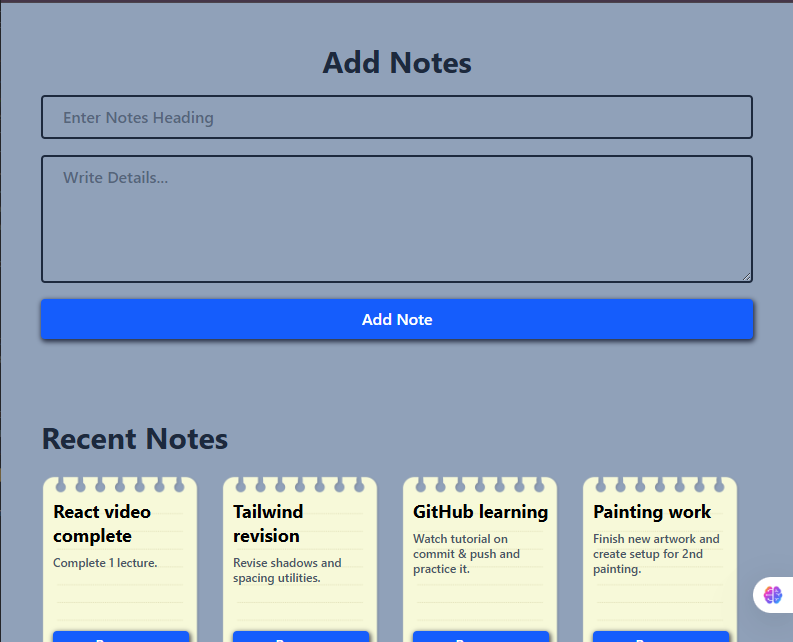
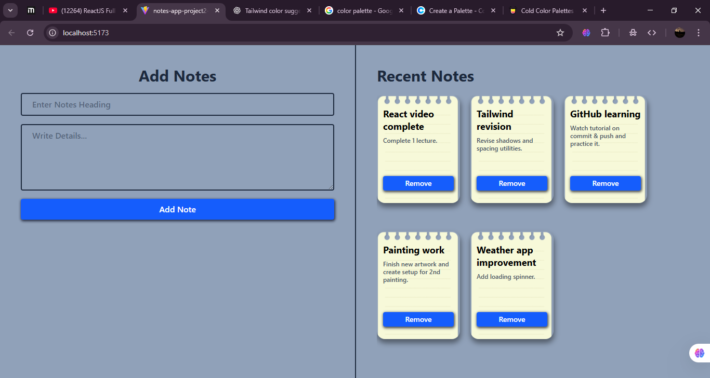

# 📝 React Notes App

A simple and clean **Notes App** built with **React** and **Tailwind CSS**.  
Users can add small notes with a title and description, and manage them in a minimal UI.

---

## 🚀 Features

- Add new notes with **title** and **details**
- Display notes in a clean, card-style layout
- Delete notes easily
- Responsive design using **Tailwind CSS**
- Simple and beginner-friendly code structure

---

## 🎯 Concepts Used in This Project

This project is focused on practicing important React concepts:

- ✅ **Array with useState** – Store and manage the list of notes as an array in state  
- ✅ **Destructuring** – Use object and array destructuring for cleaner code  
- ✅ **Form Handling** – Handle form submission and prevent default reload  
- ✅ **Two-way Binding** – Sync input fields with state using `value` and `onChange`

---

## 🛠️ Tech Stack

- **React** (with Vite)
- **Tailwind CSS**
- **JavaScript (ES6+)**

---

## 📸 Screenshots

### 📌 Image 1  

### 📌 Image 2

---

## 🌱 Future Improvements
- Add edit feature
- Add search functionality
- Save notes in localStorage

---

## ⚙️ Installation

1. Clone repo  
2. npm install  
3. npm run dev
   
